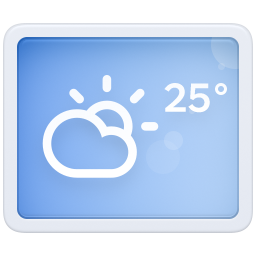

<p align="center">
  
</p>

<h1 align="center">锤子天气复刻 (Smartisan Weather Revived)</h1>

<p align="center">
  <a href="https://kotlinlang.org"></a>
  <a href="https://developer.android.com/build"></a>
  <a href="https://developer.android.com/about/versions/oreo/android-8.1"></a>
  
</p>

Smartisan OS 早已退出历史舞台，其中的天气应用也留在了旧 Android 里，但它的设计并未随时间过时。

它延续了 Smartisan OS 一贯的设计取向：白、灰、黑构成安静的底色，拟物化的质感没有盖过信息本身，温度、天气和预报始终处在最清楚的位置。随天气变化的背景为界面添上情绪，刷新、城市切换和温标转换时的动画，则让每次操作得到细腻而明确的回应。功能不算复杂，却在信息、质感和趣味之间找到了很好的分寸。

为了延续这套设计，本项目以原版 APK 为基准，使用现代 Android 技术栈重写这款天气应用，并将原先不够准确的天气数据源替换为更准确的小米天气。界面延续原版的设计语言，动画与交互结合现代 Android 重新打磨，让它能够在现代 Android 设备上自然、流畅、可靠地运行；同时围绕运行性能与后台耗电持续优化主线程更新和网络请求，在不牺牲动画反馈与天气时效的前提下追求极致体验。新的数据链路则支持中国及全球城市，中国城市使用小米混合数据，全球城市使用接口返回的 AccuWeather 数据。

## 相较原版的改进

- **新增深色模式**：原版 Smartisan OS 没有深色模式。本项目按 Android 夜间主题规范，对主天气、城市管理与搜索、天气预警、弹框和系统栏进行了完整适配；同时保留原版 PNG、NinePatch 的形状、阴影和交互状态，使深色界面仍然保持 Smartisan 风格。
- **新增桌面天气小组件**：原版天气没有桌面小组件。本项目新增“天气窗”，提供 `2×2` 紧凑布局、`3×2` 展开布局和 `4×2` 宽屏布局：`2×2` 展示当前天气核心信息，`3×2` 加入短时预报，`4×2` 最多展示四个逐小时预报。小组件可以固定显示一座城市，也可以自动优先跟随定位城市，并支持手动刷新和点击进入应用。
- **更换天气数据源**：将原先不够准确的天气数据源替换为更准确的小米天气；中国城市使用小米混合数据，全球城市使用同一接口返回的 AccuWeather 数据，搜索、定位、城市管理、缓存和桌面小组件也因此支持全球城市。
- **统一数据口径**：应用只通过小米天气这一条协议链路取数，不叠加备用天气 API；网络失败时读取同一城市、同一 provider 的本地缓存，避免不同天气模型之间的数据跳变。
- **重新实现城市与定位**：城市搜索、坐标反查和天气城市匹配使用新的数据层，可保存中国及全球城市；定位基于 Android 系统能力，不依赖第三方定位 SDK。
- **现代数据架构**：使用 Room、DataStore、Coroutines、ViewModel 和 StateFlow 管理城市、设置、缓存与页面状态。
- **优化性能与耗电**：主页面按城市增量更新，自动复用短时间内的新鲜缓存，小组件采用受控并发刷新，在不降低天气时效和动画体验的前提下减少重复计算与网络请求。
- **适配现代 Android**：支持 edge-to-edge、手势导航、刘海与系统栏 Insets，并对平板、折叠屏和多窗口中的内容宽度进行约束。
- **清理历史包袱**：源码全部使用 Kotlin，不依赖原版系统框架，不保留旧包路径、旧数据库或旧设置迁移代码。

## 当前功能

- 实时天气、逐小时预报和逐日预报；按城市数据能力展示空气质量与天气预警
- 中国及全球城市切换、搜索、管理与拖拽排序
- 全球范围的系统定位、天气城市匹配和本地缓存
- 全球城市按所在地时区显示更新时间并判断昼夜
- 摄氏度 / 华氏度切换及原版风格动画
- 城市分页、边界阻尼、刷新反馈和天气背景过渡
- 跟随系统的深色模式
- `2×2`、`3×2`、`4×2` 三种桌面天气小组件布局，可选择固定城市或优先跟随定位城市
- 首次启动使用说明、系统定位权限申请及定位城市写入

## 天气数据

应用只连接小米天气 `wtr-v3` 接口，不直接请求 AccuWeather，也不叠加其他备用天气 API。

- 中国城市使用 `weathercn:` 标识及小米混合数据。
- 全球城市使用 `accu:` 标识及小米接口返回的 AccuWeather 数据。
- 更新时间、昼夜状态和桌面小组件会按城市所在地时区计算。
- 全球城市的预报天数、空气质量、天气预警和生活指数可能少于中国城市；界面会按真实返回内容自然降级，不补造缺失数据。

实际内容、准确性和可用性以小米天气及对应数据提供方为准。

## 技术栈

| 类别 | 技术 |
| --- | --- |
| 构建 | Android Gradle Plugin `9.4.0-alpha04`、Gradle `9.6.1`、JDK 25（Java 17 字节码） |
| 语言 | Kotlin `2.4.0` |
| UI | 应用页面使用 XML Layout、Android View、自定义 View、多 Activity；桌面小组件使用 Jetpack Glance |
| 状态 | ViewModel、StateFlow、Coroutines `1.11.0` |
| 存储 | Room `3.0.0`、bundled SQLite `2.7.0`、DataStore `1.2.1` |
| 网络 | `HttpURLConnection`、`org.json` |
| SDK | `minSdk 27` / `targetSdk 37` / `compileSdk 37` |

## 构建

准备 JDK 25 和 Android SDK，然后执行：

```bash
./gradlew testDebugUnitTest assembleDebug lintDebug
```

Debug APK 位于 `app/build/outputs/apk/debug/`。

## 致谢

感谢 [People-11](https://github.com/People-11/) 的 [SmartisanOS_APP_Port](https://github.com/People-11/SmartisanOS_APP_Port/) 移植工作。本项目使用该项目提供的 `Weather_8.1.3.apk` 进行逆向分析，用于提取原版资源，并确认 UI 层级、视觉细节与交互行为。

## 免责声明

本项目与字节跳动、小米及 AccuWeather 无关，仅为个人兴趣驱动的非官方重写。

- Smartisan OS、相关商标、视觉设计及原版素材的知识产权归原权利人所有。
- 天气数据仅供参考，准确性和可用性以小米天气及对应数据提供方为准。
